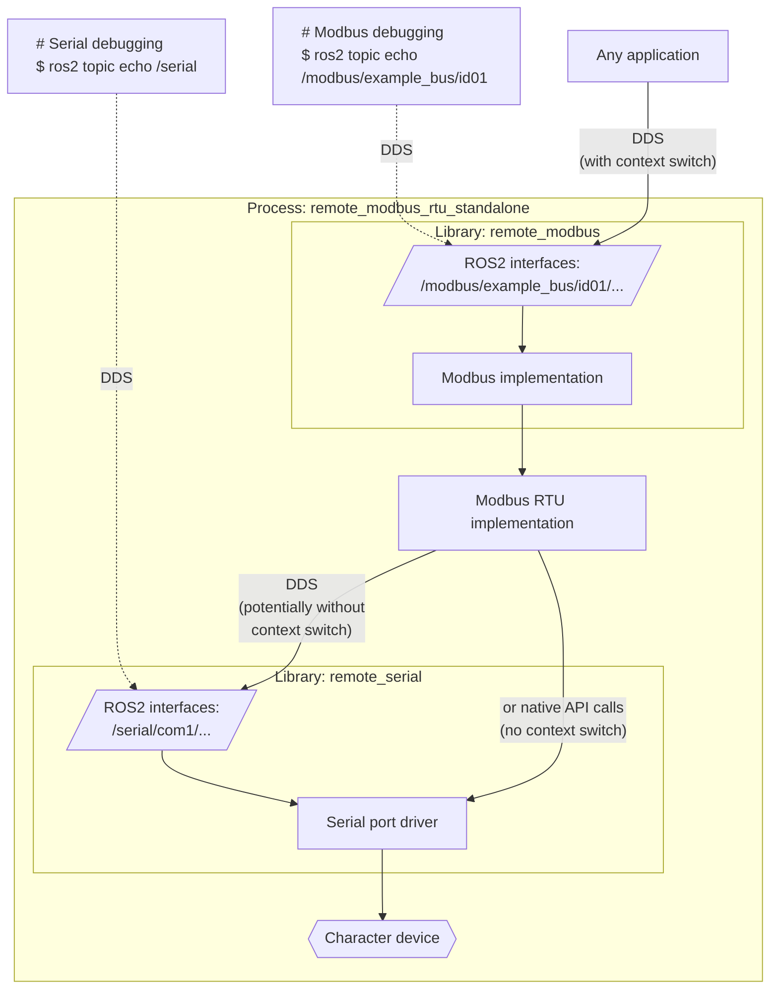
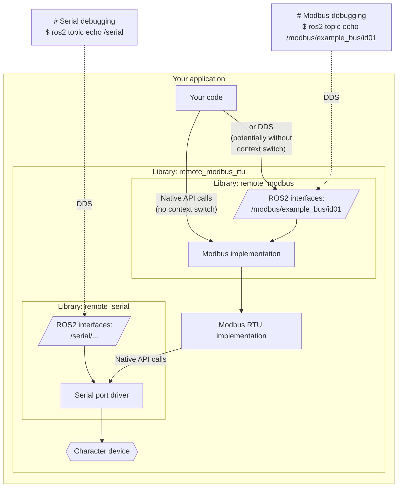

# ROS2 Modbus RTU driver

[](./LICENSE.txt)

This package is an ultimate C++ implementation of Modbus RTU for ROS2.

It can be used either as a library or a standalone process. In both cases it
provides messaging topics for introspection and debugging. It performs wisely
in case of serial line saturation in any of the I/O directions.

### Modbus RTU via ROS2 interface

```
$ ros2 run remote_modbus_rtu remote_modbus_rtu_standalone \
  --ros-args \
  --remap modbus_rtu:__node:=modbus_rtu_example_bus \
  -p modbus_is_remote:=false \
  -p modbus_prefix:=/modbus/example_bus \
  -p serial_is_remote:=false \
  -p serial_prefix:=/serial/com1 \
  -p serial_dev_name:=/dev/ttyS0 \
  -p serial_baud_rate:=115200 \
  -p serial_data:=8 \
  -p serial_parity:=false \
  -p serial_stop:=1 \
  -p serial_flow_control:=true
...

$ ros2 run <<<your package>>> <<<your executable>>> \
   --ros-args \
   -p modbus_prefix:=/modbus/example_bus \
   ...
```

This way the devices get exposed to all other ROS2 nodes (including remote ones
and troubleshooting/debugging tools).



### Modbus RTU via native API interface

```
$ ros2 run <<<your package>>> <<<your executable>>> \
  --ros-args \
  --remap modbus_rtu:__node:=modbus_rtu_example_bus \
  -p modbus_is_remote:=false \
  -p modbus_prefix:=/modbus/example_bus \
  -p serial_is_remote:=false \
  -p serial_prefix:=/serial/com1 \
  -p serial_dev_name:=/dev/ttyS0 \
  -p serial_baud_rate:=115200 \
  -p serial_data:=8 \
  -p serial_parity:=false \
  -p serial_stop:=1 \
  -p serial_flow_control:=true
...
```
This way the devices can be accessed directly (without DDS calls via networking
stack) for best performance. If the performance benefits are not critical, the
same ROS2 messaging interface can also be used even if the library is linked
into the same process (for simple packaging or any other reason).

At the same time, the same bus will be expose to other ROS2 nodes
via DDS. However the performance benefit will only be enjoyed by the process
that is linked with this library directly.



### Usage

#### Configurable

The following code uses either local native API or remote ROS2 interface calls depending on the parameter "modbus_is_remote":

```c++
#include "remote_modbus_rtu/factory.hpp"

...
  auto modbus_rtu_impl = remote_modbus_rtu::Factory::New(this);
  modbus_rtu_impl->holding_register_read(...);
...
```

#### Deterministic

The following code initializes Modbus RTU locally and uses native API calls:

```c++
#include "remote_modbus_rtu/implementation.hpp"

...
  auto modbus_rtu_impl = std::make_shared<remote_modbus_rtu::Implementation>(this);
  modbus_rtu_impl->holding_register_read(...);
...
```
