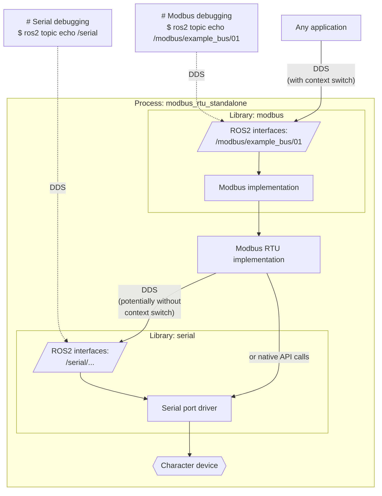
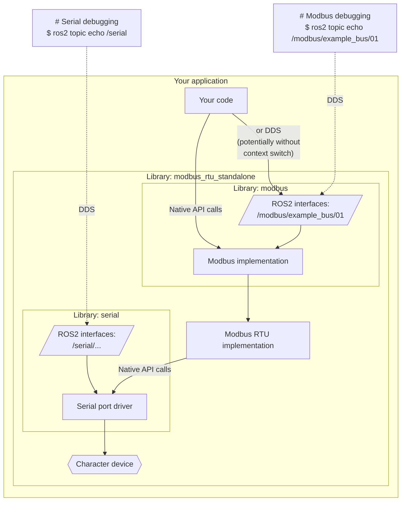

# ROS2 Modbus RTU

## Introduction

This package is an ultimate C++ implementation of Modbus RTU for ROS2. It is
intended to implement in

It can be used either as a library or a standalone process. In both cases it
provides messaging topics for introspection and debugging. It performs wisely
in case of serial line saturation in any of the I/O directions.

It is a part of [the OpenVMP project](https://github.com/openvmp/openvmp)
But it is made to be universal and usable anywhere.

## Overview

There are two ways how to use ROS2 Modbus RTU in your projects.

### Modbus RTU via ROS2 interface

This way the devices get exposed to all other ROS2 nodes (including remote ones
and troubleshooting/debugging tools).

### Modbus RTU via native API interface

This way the devices can be accessed directly (without DDS calls via networking
stack) for best performance. If the performance benefits are not critical, the
same ROS2 messaging interface can also be used even if the library is linked
into the same process (for simple packaging or any other reason).

At the same time, the same bus will be expose to other ROS2 nodes
via DDS. However the performance benefit will only be enjoyed by the process
that is linked with this library directly.

